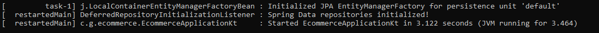
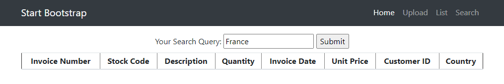
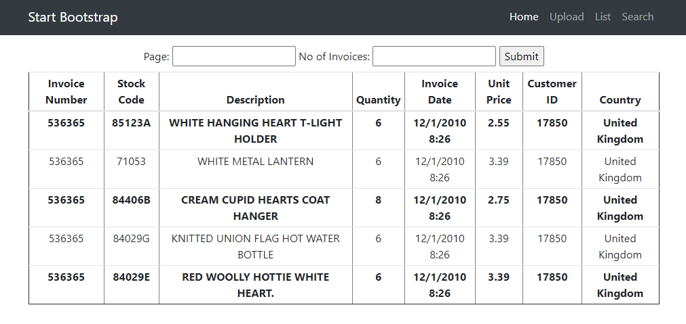

# ecommerce-simple-app

A simple app in which you can perform the following:
- Upload a csv file.
- List the details of the csv file.
- Search the details of the csv file.

It is based on the following technologies:
- Spring Boot / Spring Webflux
- H2 in-memory database
- Thymeleaf templates
- Bootstrap / JQuery

## Requirements

For building and running the application you need:

- [JDK 1.8](http://www.oracle.com/technetwork/java/javase/downloads/jdk8-downloads-2133151.html)
- [Maven 3](https://maven.apache.org)
- [Git](https://git-scm.com/downloads)

## Getting Started

### Clone
To get started you can simply clone this repository using git:
```
git clone https://github.com/joozybrain/ecommerce.git
cd ecommerce
```
You can run the application from the command line using:
```shell
mvnw spring-boot:run
```
Once you have seen the message below, the spring boot application has completed its startup 
and you can access the application using your web browser.



## Usage

Enter the following url into your web brower:

```shell
http://localhost:8080
```
You will see the landing page of ecommerce simple app


You can upload a csv file


Search in the csv file



And finally list the contents of the file!



## Roadmap
There are a few outstanding enhancements in which I will like to implement down the road:
1. Improve exception handling for the following:
    - File upload
    - Runtime exception
   

2. Out of memory heap exception on some machine when performing H2 saveall() function.


3. Better file handling validation at front end.


4. Improve search result pagination.


5. Better searching criteria.

## Copyright

Released under the Apache License 2.0. See the [LICENSE](https://github.com/codecentric/springboot-sample-app/blob/master/LICENSE) file.
